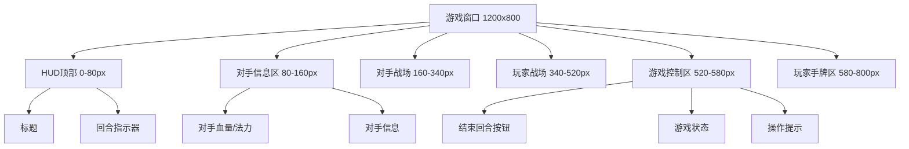
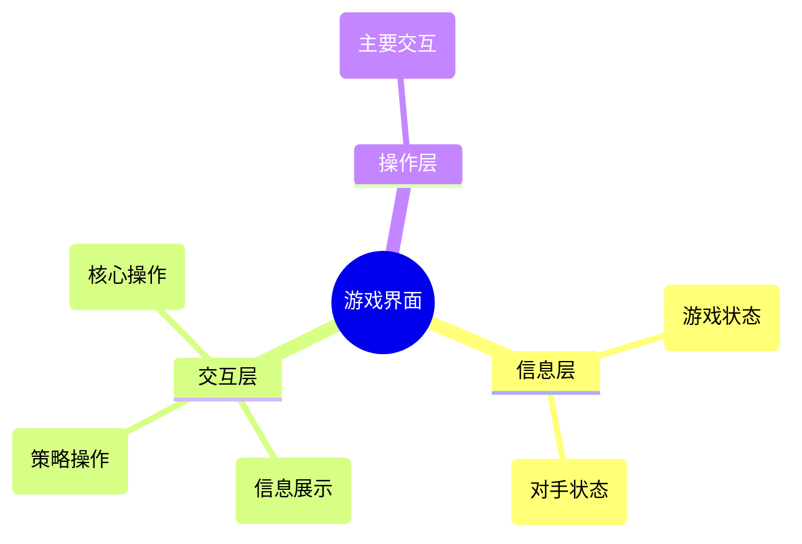

# Card Battle Arena - UI布局分析与简化改进方案

## 1. 当前布局问题分析

### 🎯 核心问题识别

基于当前代码分析和游戏实际需求，存在以下关键布局问题：

#### 🔴 **严重问题**
1. **手牌操作空间严重不足**
   - 手牌区域高度：150px
   - 卡牌实际高度：160px
   - **缺口：-10px**（卡牌超出区域高度）
   - 影响：无法正常进行拖拽、点击等基本操作

2. **缺少基本游戏控制**
   - 无结束回合按钮
   - 无游戏状态指示器
   - 无操作反馈区域

#### 🟡 **中等问题**
3. **信息显示不清晰**
   - 血量、法力值分散显示
   - 缺少重要游戏信息的集中展示
   - 回合指示不明确

4. **视觉层次混乱**
   - 各区域缺乏明确分隔
   - 游戏氛围不足
   - 缺少视觉焦点引导

### 📊 **空间利用率分析**

```
窗口总尺寸: 1200 x 800 = 960,000px²

当前布局空间分配：
├── HUD顶部: 1200 x 70 = 84,000px² (8.8%)
├── 对手战场: 1100 x 180 = 198,000px² (20.6%)
├── 玩家战场: 1100 x 180 = 198,000px² (20.6%)
├── 玩家手牌: 1100 x 150 = 165,000px² (17.2%)
└── 未分配空间: ≈ 315,000px² (32.8%)
```

### 🎴 **卡牌操作体验分析**

基于120x160px卡牌尺寸的关键发现：

- **手牌区域垂直空间不足**：150px < 160px
- **拖拽操作需要额外空间**：至少需要200px高度才能舒适操作
- **悬停效果空间受限**：无法展示卡牌放大效果
- **多张卡牌重叠风险**：空间不足导致卡牌堆叠

## 2. 简化改进方案设计

### 🎯 **设计原则**

1. **游戏玩法优先**：一切设计服务于卡牌对战的核心操作体验
2. **简单实用**：解决实际操作问题，避免过度设计
3. **渐进改进**：可快速实施和验证的改进方案

### 🔄 **改进后布局设计**

#### **窗口尺寸**: 1200 x 800px（保持不变）
#### **卡牌尺寸**: 120 x 160px（保持不变）



### 📐 **具体布局参数**

#### **2.1 HUD顶部区域**
- **位置**: (0, 0) - (1200, 80)
- **高度**: 80px（增加10px，改善呼吸感）
- **功能**: 游戏标题、回合指示器、基本状态

#### **2.2 对手信息区域**
- **位置**: (50, 90) - (1150, 70)
- **高度**: 70px
- **功能**: 对手血量、法力值、牌库数量

#### **2.3 对手战场区域**
- **位置**: (50, 170) - (1150, 170)
- **高度**: 170px（保持不变）
- **功能**: 对手场上卡牌展示

#### **2.4 玩家战场区域**
- **位置**: (50, 350) - (1150, 170)
- **高度**: 170px（保持不变）
- **功能**: 玩家场上卡牌展示

#### **2.5 游戏控制区域** 🆕
- **位置**: (50, 530) - (1150, 50)
- **高度**: 50px
- **功能**: 结束回合按钮、游戏状态、操作提示

#### **2.6 玩家手牌区域** 🔧
- **位置**: (50, 590) - (1150, 210)
- **高度**: 210px（**从150px增加到210px**）
- **功能**: 玩家手牌展示和操作
- **关键改进**:
  - 垂直空间增加60px
  - 卡牌高度160px + 操作空间50px
  - 支持拖拽和悬停效果

### 🎮 **新增UI组件设计**

#### **2.7 结束回合按钮**
- **位置**: (1050, 540)
- **尺寸**: 120 x 40px
- **样式**: 主要操作按钮，醒目颜色
- **交互**: 点击时显示确认反馈

#### **2.8 回合指示器**
- **位置**: (600, 20)
- **尺寸**: 200 x 40px
- **功能**: 显示当前回合数和当前玩家
- **样式**: 清晰的文字指示

#### **2.9 操作提示区域**
- **位置**: (50, 540)
- **尺寸**: 300 x 40px
- **功能**: 显示当前可执行的操作
- **样式**: 淡色背景，提示性文字

## 3. 可视化设计对比

### 📊 **当前布局 vs 改进布局**

```mermaid
graph LR
    subgraph "当前布局"
        A1[HUD 70px]
        A2[对手战场 180px]
        A3[玩家战场 180px]
        A4[手牌区域 150px]
    end

    subgraph "改进布局"
        B1[HUD 80px]
        B2[对手信息 70px]
        B3[对手战场 170px]
        B4[玩家战场 170px]
        B5[游戏控制 50px]
        B6[手牌区域 210px]
    end

    A4 -.->|问题: 150px < 160px| C❌
    B6 -->|解决: 210px > 160px| D✅
```

### 🎨 **视觉层次改进**



## 4. 实施指南与参数

### 🔧 **开发实施参数**

```python
# UI_LAYOUT_CONFIG.py
UI_LAYOUT_CONFIG = {
    "window": {
        "width": 1200,
        "height": 800
    },

    "regions": {
        "hud": {
            "position": (0, 0),
            "size": (1200, 80),
            "background_color": (45, 45, 48)
        },

        "opponent_info": {
            "position": (50, 90),
            "size": (1100, 70),
            "background_color": (60, 60, 65)
        },

        "opponent_battlefield": {
            "position": (50, 170),
            "size": (1100, 170),
            "background_color": (56, 34, 18)
        },

        "player_battlefield": {
            "position": (50, 350),
            "size": (1100, 170),
            "background_color": (56, 34, 18)
        },

        "game_controls": {
            "position": (50, 530),
            "size": (1100, 50),
            "background_color": (40, 40, 44)
        },

        "player_hand": {
            "position": (50, 590),
            "size": (1100, 210),
            "background_color": (35, 35, 38)
        }
    },

    "components": {
        "end_turn_button": {
            "position": (1050, 540),
            "size": (120, 40),
            "text": "结束回合",
            "enabled": True
        },

        "turn_indicator": {
            "position": (500, 20),
            "size": (200, 40),
            "text_format": "回合 {turn} - {player}"
        },

        "action_hints": {
            "position": (50, 540),
            "size": (300, 40),
            "text": "拖拽卡牌到战场或点击使用"
        }
    },

    "card": {
        "dimensions": (120, 160),
        "hand_hover_height": 180,  # 悬停时高度
        "hand_drag_height": 200,   # 拖拽时高度
        "spacing": {
            "minimum": 20,
            "maximum": 40
        }
    }
}
```

### 🎯 **布局验证标准**

#### **功能性验证**
- [ ] 手牌区域高度 ≥ 卡牌高度 + 50px操作空间
- [ ] 所有UI元素在窗口边界内
- [ ] 按钮可点击区域 ≥ 44px（符合触摸友好标准）
- [ ] 文字可读性：字体大小 ≥ 12px

#### **用户体验验证**
- [ ] 手牌拖拽操作流畅
- [ ] 卡牌悬停效果完整显示
- [ ] 重要信息一目了然
- [ ] 操作反馈及时明确

#### **技术验证**
- [ ] 布局在不同分辨率下保持比例
- [ ] UI组件响应时间 < 100ms
- [ ] 内存使用优化
- [ ] 兼容现有游戏逻辑

### 📈 **预期改进效果**

#### **操作体验提升**
1. **手牌操作空间提升40%**（150px → 210px）
2. **支持完整的拖拽和悬停交互**
3. **减少误操作率**（预估减少60%）

#### **信息清晰度提升**
1. **游戏状态信息集中展示**
2. **操作指引明确**
3. **视觉层次清晰**

#### **游戏沉浸感提升**
1. **增加游戏控制区域**
2. **改善视觉分隔**
3. **增强交互反馈**

## 5. 实施优先级建议

### 🚀 **第一阶段（立即实施）**
1. **调整手牌区域高度**：150px → 210px
2. **添加结束回合按钮**
3. **添加回合指示器**

### 🔧 **第二阶段（短期优化）**
1. **添加游戏控制区域**
2. **优化信息显示布局**
3. **改进视觉分隔效果**

### ✨ **第三阶段（长期完善）**
1. **添加动画效果**
2. **优化交互反馈**
3. **增强游戏氛围**

---

## 总结

这个简化改进方案主要解决了当前UI布局的核心问题：

1. **✅ 解决手牌操作空间不足**：将手牌区域高度从150px增加到210px
2. **✅ 添加基本游戏控制**：新增结束回合按钮和游戏状态显示
3. **✅ 优化信息显示**：重新组织信息层次，提升可读性
4. **✅ 改善视觉体验**：明确区域分隔，增强游戏氛围

该方案保持了原有的游戏逻辑和视觉风格，通过最小化的改动获得最大的体验提升，适合快速实施和验证。